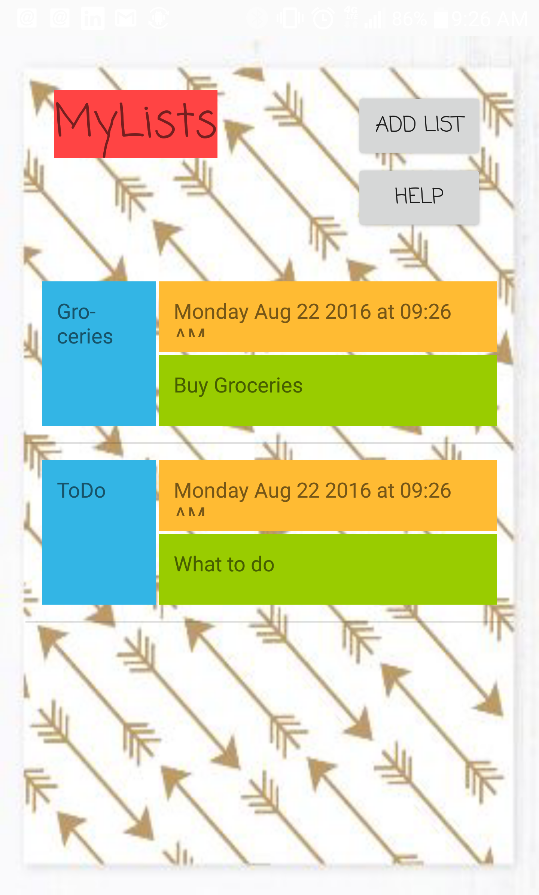
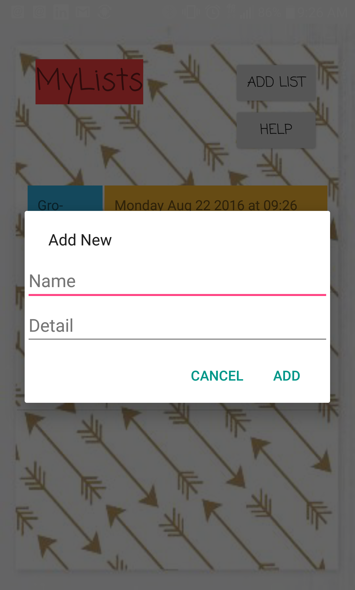
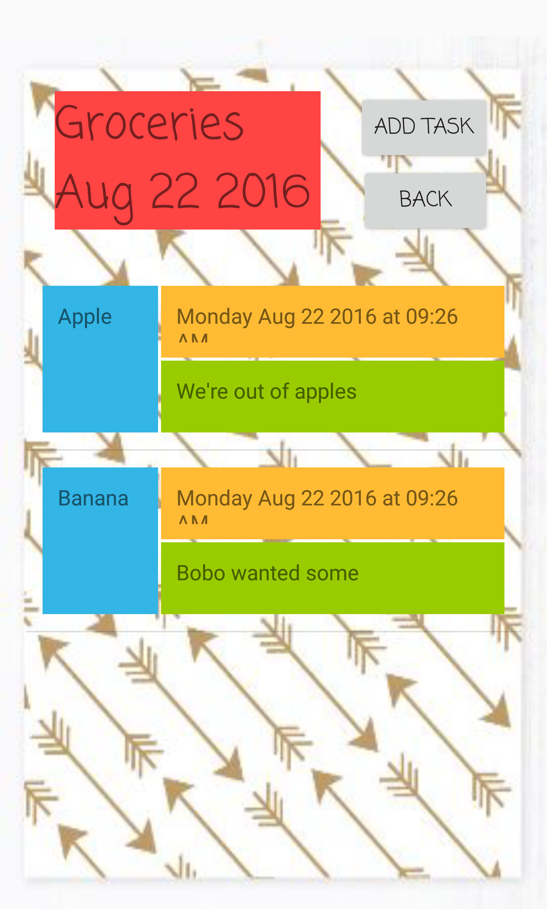

# Simple To-do List | By: Leo Montegrande

A simple android todo list that you can use to create todo lists... Until the app is restarted.

---
### Requirements

1. **Implement the prototype** you created
2. **View a collection of to-do lists**
3. **View items on a to-do list**
4. Allow the user to **create a new to-do list**
5. **Add items** to each to-do list
6. **Display correctly in both landscape and portrait orientations**

**Bonus:**

- Show an error message if invalid input is given
- Allow the user to check off and remove completed items
- Add an item detail screen that allows the user to give an optional description for each item.

---
### Results

- User can create their own lists
- Each list can hold an arbitrary amount of tasks
- Data is persistant within a session.
- User can delete items
- Simple to use but very informative UI

---

